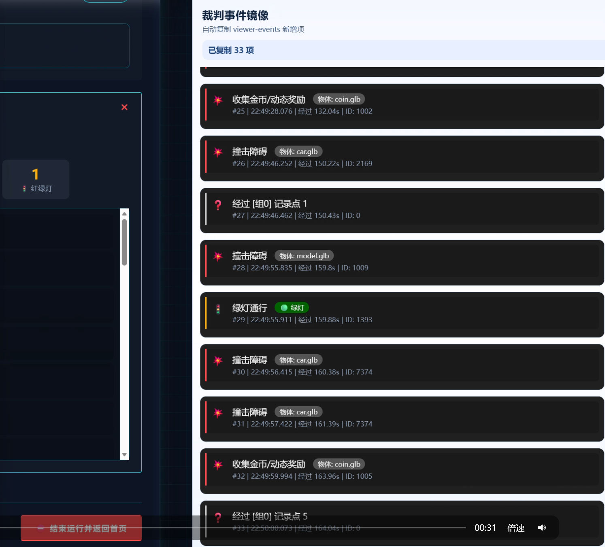

# Smart Car 自动刷新裁判事件

自动刷新裁判事件并显示事件到侧边容器的浏览器插件。

**注意事项：**

因为点击查看事件按钮后，系统会自动滚动原页面到对应事件，所以 **无法手动滚动原系统页面**，侧边容器内的事件列表可以正常滚动。

我尝试禁用原来系统的滚动事件，但是网站似乎应用了CSP（内容安全策略）阻止内联脚本执行，搞了一会懒得折腾了。将就着用吧。所以 **不适合使用ar预览和网页的摇杆**，适合自己上车跑。

## 使用方法

### 1. 设置ip

修改manifest.json文件第9行，把matches中的ip换成你的板卡ip地址

### 2. 加载

谷歌/Edge等浏览器加载插件，自己搜方法。

### 3. 想用摇杆就禁用插件就行

## 预览

显示在原裁判系统右侧。